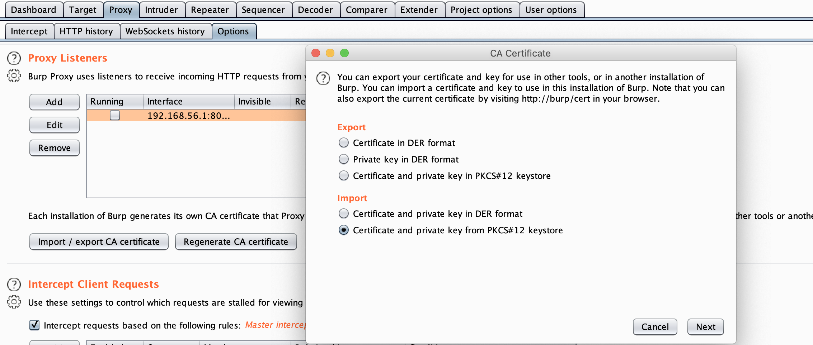
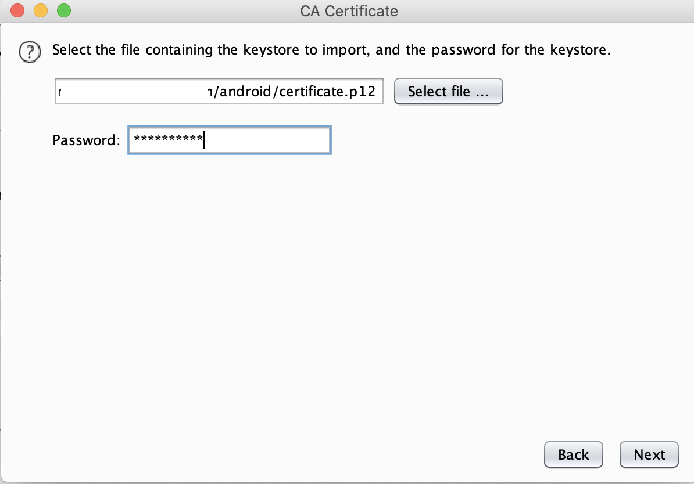

# install_cert*
Scripts to generate and install proxy certificate to system certificate store for android api level > 23.


## Usage
* Ensure that your device/emulator is connected via adb by executing command: `adb devices`
  ```bash
  #~ adb devices
  List of devices attached
  192.168.56.101:5555	device
  ```
* Run the script based on the type of device / emulator you are using.
  ```bash
  #~ ./install_cert_emulator.sh 
   Generating a 2048 bit RSA private key
  .......................................................................................................+++
  ...............................+++
  writing new private key to 'pk.key'
  -----
  Copying cert to the device
  863da4b2.0: 1 file pushed, 0 skipped. 6.1 MB/s (1257 bytes in 0.000s)
  -rw-rw---- 1 root sdcard_rw 1257 2020-09-16 13:16 /sdcard/863da4b2.0
  Mounting /system as writable
  /dev/block/sda6 on /system type ext4 (ro,seclabel,noatime,data=ordered)
  /dev/block/sda6 on /system type ext4 (rw,seclabel,noatime,data=ordered)
  Adding 863da4b2.0 to the system certs
  -rw-rw---- 1 root sdcard_rw 1257 2020-09-16 13:16 863da4b2.0
  Rebooting device
  ```
* In burp window, navigate to Proxy > Options, click on `Import / export CA certificate`, select `Certificate and private key from pkcs#12 store` and click on next.
  

* Select the `certificate.p12` file generated by the script, enter `1234567890` as password and click on next.
  
